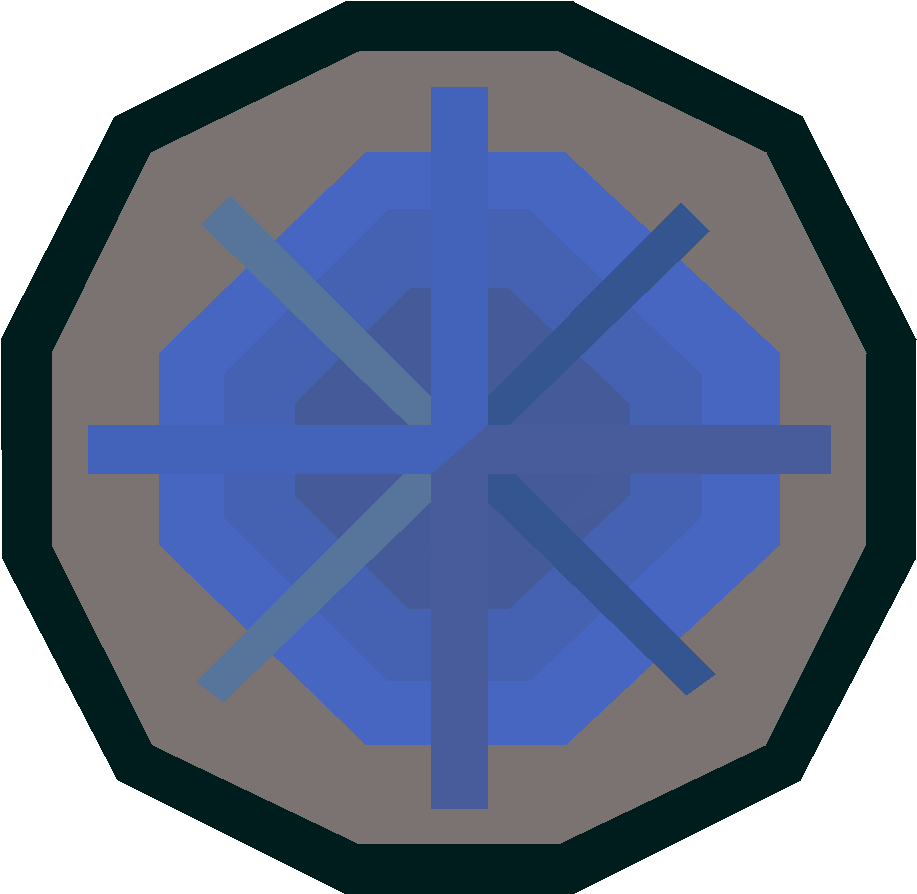

<!-- Improved compatibility of back to top link: See: https://github.com/othneildrew/Best-README-Template/pull/73 -->

<a name="readme-top"></a>

<!-- PROJECT SHIELDS -->
<!--
*** I'm using markdown "reference style" links for readability.
*** Reference links are enclosed in brackets [ ] instead of parentheses ( ).
*** See the bottom of this document for the declaration of the reference variables
*** for contributors-url, forks-url, etc. This is an optional, concise syntax you may use.
*** https://www.markdownguide.org/basic-syntax/#reference-style-links
-->

<!-- [![Contributors][contributors-shield]][contributors-url] -->
<!-- [![Forks][forks-shield]][forks-url] -->
<!-- [![Stargazers][stars-shield]][stars-url] -->
<!-- [![Issues][issues-shield]][issues-url] -->

[![MIT License][license-shield]][license-url]
[![LinkedIn][linkedin-shield]][linkedin-url]

<!-- PROJECT LOGO -->
<br />
<div align="center">
  <a href="https://rune-it-back.onrender.com">
    
  </a>

  <h3 align="center">Rune-it-Back</h3>

  <p align="center">
    An assortment of Old School Runescape web tools including a quest database and a web scraper of the official OSRS wikipedia.
    <br />
    <a href="https://rune-it-back.onrender.com">View Demo</a>

  </p>
</div>

<!-- TABLE OF CONTENTS -->
<details>
  <summary>Table of Contents</summary>
  <ol>
    <li>
      <a href="#about-the-project">About The Project</a>
      <ul>
        <li><a href="#built-with">Built With</a></li>
      </ul>
    </li>
    <li>
      <a href="#getting-started">Getting Started</a>
      <ul>
        <li><a href="#prerequisites">Prerequisites</a></li>
        <li><a href="#installation">Installation</a></li>
      </ul>
    </li>
    <li><a href="#usage">Usage</a></li>
    <li><a href="#features">Features</a></li>
    <li><a href="#roadmap">Roadmap</a></li>
    <li><a href="#license">License</a></li>
    <li><a href="#contact">Contact</a></li>
    <li><a href="#acknowledgments">Acknowledgments</a></li>
  </ol>
</details>

<!-- ABOUT THE PROJECT -->

## About The Project

[![Product Name Screen Shot][product-screenshot]](https://rune-it-back.onrender.com)

Rune-it-Back

A simple collection of Old School Runescape web tools created using Java, SpringBoot, and React, to view and interact with Old School Runescape quest data sourced from the official Old School Runescape Wikipedia.

<p align="right">(<a href="#readme-top">back to top</a>)</p>

### Built With

Backend

- Spring Boot
- Maven
- OAuth

Frontend

- React
- TailwindCSS
- Cheerio

<p align="right">(<a href="#readme-top">back to top</a>)</p>

<!-- GETTING STARTED -->

## Getting Started

Visit the live site or clone the repo and run the java project in conjunction wtih the frontend folder or use the docker image to build.

### Prerequisites

- npm
  ```sh
  npm install npm@latest -g
  ```
- java
  ```sh
  download from oracle
  ```

### Installation

1. Clone the repo
   ```sh
   git clone https://github.com/AlexDoes/Rune-it-back.git
   ```
2. Install NPM packages
   ```sh
   npm install
   ```
3. Clean Install Maven
   ```sh
   maven clean install
   ```

<p align="right">(<a href="#readme-top">back to top</a>)</p>

<!-- USAGE EXAMPLES -->

## Usage

Utilize the various tools through the navbar. Sign in with your Google Account to save data from the Quester tool to track your progress.

## Features

- [Runescraper](https://rune-it-back.onrender.com/runescraper) to scrape from the official OSRS wiki for up to date quest data and the html associated.
  [![runescraper][runescraper-screenshot]](https://rune-it-back.onrender.com/runescraper)

- [Quester](https://rune-it-back.onrender.com/quester) to calculate/track quest rewards and how much you've/you'll gain from completing quests.
  [![quester][quester-screenshot]](https://rune-it-back.onrender.com/quester)

- [AQD](https://rune-it-back.onrender.com/aqd) to render a table of all up to date quest data.
  [![aqd][aqd-screenshot]](https://rune-it-back.onrender.com/aqd)

<p align="right">(<a href="#readme-top">back to top</a>)</p>

<!-- ROADMAP -->

## Roadmap

- [x] Add Quest Data
- [x] Add Quester
- [x] Add Webscraper
- [ ] Add high scores

<p align="right">(<a href="#readme-top">back to top</a>)</p>

<!-- LICENSE -->

## License

Distributed under the MIT License. See `LICENSE.txt` for more information.

<p align="right">(<a href="#readme-top">back to top</a>)</p>

<!-- CONTACT -->

## Contact

Alex Wong

[LinkedIn](https://www.linkedin.com/in/alwong191/)
</br>
[Porftolio](https://alexswe.com/)
</br>
[Github](https://github.com/AlexDoes)

Steven Sookhai

[LinkedIn](https://www.linkedin.com/in/steven-sookhai-37192a22a/)
</br>
[Porftolio](https://alexswe.com/)
</br>
[Github](https://github.com/StevenSookhai)

Project Link: [https://github.com/AlexDoes/Rune-it-back](https://github.com/AlexDoes/Rune-it-back)

<p align="right">(<a href="#readme-top">back to top</a>)</p>

<!-- ACKNOWLEDGMENTS -->

## Acknowledgments

<!-- - [Choose an Open Source License](https://choosealicense.com) -->
<!-- - [GitHub Emoji Cheat Sheet](https://www.webpagefx.com/tools/emoji-cheat-sheet) -->
<!-- - [Malven's Flexbox Cheatsheet](https://flexbox.malven.co/) -->
<!-- - [Malven's Grid Cheatsheet](https://grid.malven.co/) -->

- [Img Shields](https://shields.io)
- [Cheerio](https://cheerio.js.org/)
<!-- - [GitHub Pages](https://pages.github.com)
- [Font Awesome](https://fontawesome.com)
- [React Icons](https://react-icons.github.io/react-icons/search) -->

<p align="right">(<a href="#readme-top">back to top</a>)</p>

<!-- MARKDOWN LINKS & IMAGES -->
<!-- https://www.markdownguide.org/basic-syntax/#reference-style-links -->

[contributors-shield]: https://img.shields.io/github/contributors/othneildrew/Best-README-Template.svg?style=for-the-badge
[contributors-url]: https://github.com/othneildrew/Best-README-Template/graphs/contributors
[forks-shield]: https://img.shields.io/github/forks/othneildrew/Best-README-Template.svg?style=for-the-badge
[forks-url]: https://github.com/othneildrew/Best-README-Template/network/members
[stars-shield]: https://img.shields.io/github/stars/othneildrew/Best-README-Template.svg?style=for-the-badge
[stars-url]: https://github.com/othneildrew/Best-README-Template/stargazers
[issues-shield]: https://img.shields.io/github/issues/othneildrew/Best-README-Template.svg?style=for-the-badge
[issues-url]: https://github.com/othneildrew/Best-README-Template/issues
[license-shield]: https://img.shields.io/github/license/othneildrew/Best-README-Template.svg?style=for-the-badge
[license-url]: https://github.com/othneildrew/Best-README-Template/blob/master/LICENSE.txt
[linkedin-shield]: https://img.shields.io/badge/-LinkedIn-black.svg?style=for-the-badge&logo=linkedin&colorB=555
[linkedin-url]: https://linkedin.com/in/alwong191/
[product-screenshot]: imgs/home.png
[quester-screenshot]: imgs/quester.png
[aqd-screenshot]: imgs/aqd.png
[runescraper-screenshot]: imgs/runescraper.png
[Next.js]: https://img.shields.io/badge/next.js-000000?style=for-the-badge&logo=nextdotjs&logoColor=white
[Next-url]: https://nextjs.org/
[React.js]: https://img.shields.io/badge/React-20232A?style=for-the-badge&logo=react&logoColor=61DAFB
[React-url]: https://reactjs.org/
[Vue.js]: https://img.shields.io/badge/Vue.js-35495E?style=for-the-badge&logo=vuedotjs&logoColor=4FC08D
[Vue-url]: https://vuejs.org/
[Angular.io]: https://img.shields.io/badge/Angular-DD0031?style=for-the-badge&logo=angular&logoColor=white
[Angular-url]: https://angular.io/
[Svelte.dev]: https://img.shields.io/badge/Svelte-4A4A55?style=for-the-badge&logo=svelte&logoColor=FF3E00
[Svelte-url]: https://svelte.dev/
[Laravel.com]: https://img.shields.io/badge/Laravel-FF2D20?style=for-the-badge&logo=laravel&logoColor=white
[Laravel-url]: https://laravel.com
[Bootstrap.com]: https://img.shields.io/badge/Bootstrap-563D7C?style=for-the-badge&logo=bootstrap&logoColor=white
[Bootstrap-url]: https://getbootstrap.com
[JQuery.com]: https://img.shields.io/badge/jQuery-0769AD?style=for-the-badge&logo=jquery&logoColor=white
[JQuery-url]: https://jquery.com

```

```
